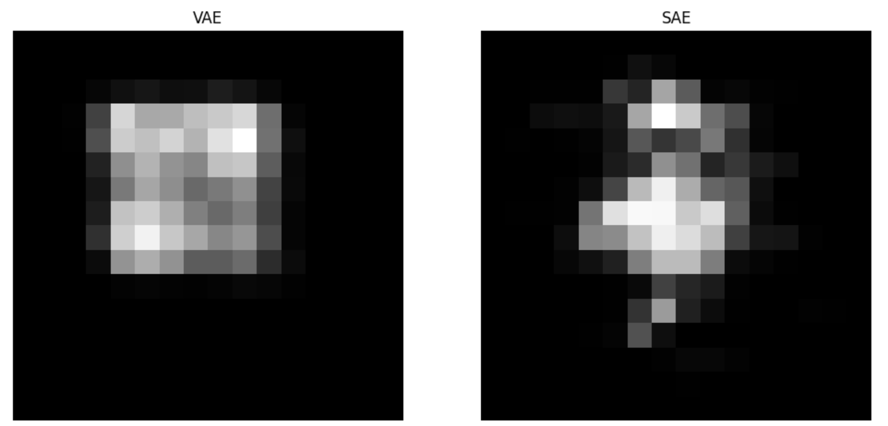

# Variational autoencoder latent space structure test

The vae.ipynb notebook compares the latent spaces of an autoencoder and a variational autoencoder by linearly interpolating between two points in the latent space. The variational autoencoder produces a more continuous set of reconstructed images.

  
Reconstructions of an interpolated latent space point with variational autoencoder (left) and autoencoder (right). The variational autoencoder reconstructs the image of a square noise patch fairly well, while the autoencoder has trouble reconstructing the object shape and location.

If you want a more practical tutorial of autoencoders go see: https://github.com/Jackson-Kang/Pytorch-VAE-tutorial
